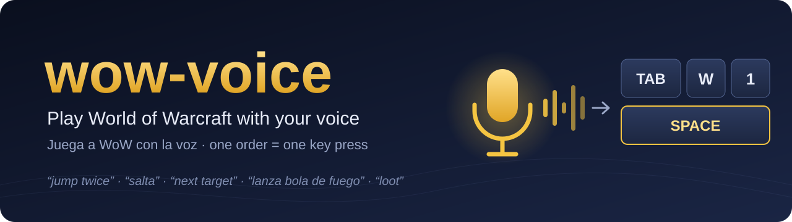
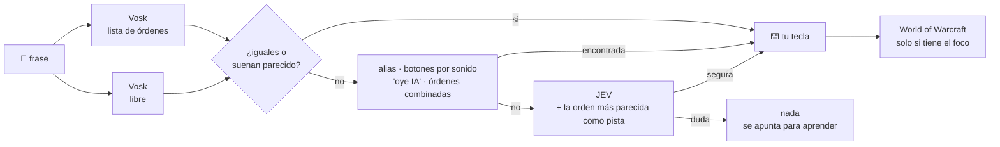

<p align="center">
  
</p>

<p align="center">
  <a href="README.md">🇬🇧 Read in English</a> ·
  <a href="#instalación-rápida">Instalación</a> ·
  <a href="#qué-puedes-decir">Qué puedes decir</a> ·
  <a href="#cómo-funciona">Cómo funciona</a> ·
  <a href="#preguntas-frecuentes">Preguntas</a>
</p>

<p align="center">
  
  
  
  
  
  
</p>

**wow-voice convierte tu voz en un mando más para World of Warcraft.** Dices *"salta"*, *"paso a la izquierda"*, *"siguiente objetivo"* o *"lanza bola de fuego"*, y pulsa la tecla que habrías pulsado tú: la que **tú** asignaste, en **tus** barras de acción. Funciona en español y en inglés, y el reconocimiento de voz se hace en tu propio PC.

No es un bot. **Una orden dicha es una tecla pulsada**, cuando la dices. Nada se repite, se encadena ni juega por ti. Está pensado para jugar con mando o con una mano en el ratón, por accesibilidad, o para tener las manos libres mientras paseas por la ciudad.

```text
21:04:24  "focus"                  -> focus                  via vosk      (84 ms)
21:15:07  "se coger todo"          -> interact (recoger)     via vosk+jev  (433 ms)
21:17:37  "volpi siniestro"        -> botón Golpe siniestro  via vosk~     (91 ms)
21:31:38  "gira izquierda"         -> turn_left 90°          via vosk      (64 ms)
```
<sub>Del log de una partida real (alineado). Aunque oiga mal, encuentra la orden: "volpi siniestro" era *Golpe siniestro*.</sub>

## Lo que lo hace distinto

- 🎯 **Lee tus teclas reales.** Un addon pequeño, que solo lee, le dice qué tecla hace cada cosa y qué hechizo, objeto o macro hay en cada botón. Dices el nombre del hechizo y pulsa la tecla de ese botón. No hay que configurar nada a mano.
- ⚡ **Rápido y sin internet.** [Vosk](https://alphacephei.com/vosk/) reconoce la voz en tu PC en 50–300 ms, dos veces a la vez: con la lista de órdenes y en libre.
- 🧠 **Entiende frases sueltas (opcional).** Si lo que dices no es una orden exacta, [JEV](#jev-opcional) (un modelo pequeño de decisiones) elige la orden que querías, o ninguna. "recoge todo eso", "tira golpe siniestro" y "gírate un poquito a la derecha" funcionan. Solo se envía el texto, nunca el audio.
- 📚 **Aprende lo que oye mal (opcional).** Una frase fallida seguida de la orden que repetiste se convierte en alias. Lo revisa cada hora un agente de IA, y el código comprueba las pruebas: una casualidad nunca se convierte en regla.
- 🎮 **Hecho para jugar con mando** y con la interfaz de mando. Funciona a la vez que el mando. Tiene un botón **Voz: ON/OFF** en el juego, pitidos por los altavoces del PC, y avisos en el chat de lo que hizo el focus y el botín.
- 🌍 **Español e inglés**, según el idioma de tu juego. Añadir un idioma es un solo archivo.
- 🛡️ **Seguro.** Las teclas solo van a la ventana de WoW, lo que se mantiene pulsado tiene un límite, y *"para"* lo suelta todo al instante.

## Instalación rápida

Necesitas un micrófono en el PC donde corre el juego, y Python 3.10 o superior.

<details open>
<summary><b>🐧 Linux</b> (Wine, Lutris, Steam/Proton) — probado</summary>

```bash
git clone https://github.com/alseif0x/wow-voice.git && cd wow-voice
./install.sh                  # entorno de Python + modelos de Vosk + addon + servicios de systemd
systemctl --user start wow-voice
journalctl --user -u wow-voice -f   # lo que oye y lo que hace
```
`install.sh` busca WoW en `~/Games`, `~/.wine` o en `compatdata` de Steam (o dale `--addons <carpeta AddOns>`). El teclado virtual necesita `/dev/uinput`, y el instalador te dice cómo permitirlo si todavía no lo está. Funciona en X11 y en escritorios Wayland, porque WoW bajo Wine es una ventana de Xwayland.
</details>

<details>
<summary><b>🪟 Windows</b> — experimental</summary>

```powershell
git clone https://github.com/alseif0x/wow-voice.git; cd wow-voice
powershell -ExecutionPolicy Bypass -File install.ps1
& "$env:LOCALAPPDATA\wow-voice\wow-voice.cmd"
```
Las teclas se envían con `SendInput` (códigos de escaneo), según tu distribución de teclado. Si WoW se ejecuta como administrador, ejecuta wow-voice también como administrador.
</details>

<details>
<summary><b>🍎 macOS</b> — experimental</summary>

```bash
git clone https://github.com/alseif0x/wow-voice.git && cd wow-voice
./install.sh
"$HOME/Library/Application Support/wow-voice/venv/bin/python" -m wowvoice
```
Da permiso a tu terminal en *Ajustes del Sistema › Privacidad y seguridad* en **Accesibilidad** (para pulsar teclas), **Micrófono** y **Grabación de pantalla** (solo para el botón ON/OFF del juego).
</details>

Después, en el juego: reinícialo una vez para que encuentre el addon **WoW Voice**, haz `/reload`, y habla. Para probar una frase sin micrófono:

```bash
python -m wowvoice --say "salta dos veces"          # -> jump x2
python -m wowvoice --say "jump twice" --lang en     # -> jump x2 (inglés)
python -m wowvoice --calibrar                       # ajusta el umbral del micrófono a tu habitación
```

## Qué puedes decir

Algunos ejemplos de cada orden. Las listas completas están en [`wowvoice/lang/es.py`](wowvoice/lang/es.py) y [`wowvoice/lang/en.py`](wowvoice/lang/en.py). Si lo dices de otra forma o suena parecido, decide JEV.

| Dices | Hace |
|---|---|
| salta · salta dos veces · brinca | Saltar (hasta 5 veces) |
| salta a la izquierda · salta adelante | Saltar moviéndote hacia ese lado |
| adelante · atrás · retrocede (+ "tres" = 3 s) | Andar hacia delante o hacia atrás un momento |
| izquierda · un poco a la derecha · gira a la izquierda · mucho a la izquierda | Girar 45° · 20° · 90° · 135° |
| media vuelta · gira a la derecha treinta grados | 180° / los grados que digas |
| paso a la izquierda · de lado a la derecha | Paso lateral |
| camina · corre · automático · sigue recto · despacio · más rápido | Echar a andar o a correr, caminar automático, cambiar de velocidad |
| para · alto · quieto | Soltarlo todo y cortar el caminar automático |
| siguiente objetivo · objetivo amigo · asiste | Objetivos |
| focus · vuelve al foco · quita el foco · focus aliado | Foco (te dice en el chat lo que hizo) |
| recoger · despojar · saquea · interactúa | Saquear el cadáver que tienes delante, hablar, abrir |
| lanza bola de fuego · piedra de hogar · botón tres | La tecla del botón donde está |
| salta y gira a la derecha, luego adelante | Hasta 3 órdenes seguidas (todas, o ninguna si una no está clara) |
| mapa · bolsas · siéntate · cierra | Sus atajos |
| voz pausa · voz activa | Dejar de escuchar / volver a escuchar |
| oye IA, ¿dónde entrego esto? | Preguntar a [WoW AI](https://github.com/chelinho139/wow-ai) (si lo tienes) |

**Pitidos:** uno ascendente al activar, uno descendente al desactivar, un tic cuando pulsa una orden, y un zumbido cuando no puede (esa acción no tiene tecla, o WoW no es la ventana activa).

## Cómo funciona



- **El addon** (`addon/WoWVoice`) solo lee. Guarda tus atajos y lo que hay en cada botón, y wow-voice lo lee tras un `/reload`. Las acciones sin tecla de teclado (las macros de foco, "interactuar", el botón Hablar de WoW AI) reciben una tecla libre, como Ctrl+Shift+F12, solo durante la sesión y sin tocar tu configuración.
- **El botón del juego** pinta un cuadrado de 8×8 píxeles en la esquina superior derecha (magenta = activo, cian = apagado), y wow-voice lo lee de la ventana del juego. No engancha ni lee la memoria del juego.
- **Las teclas** salen de un teclado virtual (`/dev/uinput` en Linux, `SendInput` en Windows, eventos de Quartz en macOS), igual que de uno de verdad.

## Extras opcionales

### JEV (opcional)
JEV (`typesafe/jev-1.13`) es un modelo de decisiones al que se accede por [OpenRouter](https://openrouter.ai/). wow-voice le hace una pregunta de opción múltiple: *¿cuál de estas órdenes, o ninguna?* Solo actúa si está seguro al 80 % o más, y los números los saca de tus palabras, nunca del modelo. Pon tu clave en `~/.config/wow-voice/openrouter.env` (`OPENROUTER_API_KEY=...`) o en el entorno. Sin ella siguen funcionando las órdenes exactas, los alias y los nombres de botones por sonido.

### Aprender de los fallos (opcional)
Cada frase que no entendió va a `~/.cache/wow-voice/misses.jsonl`, junto con la orden que dijiste justo después. Un temporizador horario (`wow-voice-learn`) se las enseña a un agente (`claude -p` por defecto; vale cualquier programa que lea un texto y responda JSON). El agente propone alias, y el código solo se queda con los que el log respalda (seguidos de esa orden dos veces, o una vez y JEV pensó lo mismo). Se guardan en `~/.config/wow-voice/learned.json`. Tus propios alias van en `~/.config/wow-voice/aliases.json`:

```json
{ "evis": "button:Eviscerar", "patada": "button:Patada", "gira un pelín": {"order": "turn_right", "degrees": 10} }
```

### WoW AI
Con el addon [WoW AI](https://github.com/chelinho139/wow-ai), *"oye IA, …"* le pasa la frase grabada a su chat, y puedes preguntar a un agente de IA por misiones, equipo o macros sin escribir.

## Configuración

`~/.config/wow-voice/config.json` cambia los valores de [`wowvoice/config.py`](wowvoice/config.py). Los que quizá quieras tocar:

| Clave | Por defecto | |
|---|---|---|
| `language` | `"auto"` | `"es"`, `"en"`, o el idioma del juego |
| `threshold` | `700` | Volumen del micrófono que cuenta como voz (`--calibrar` lo ajusta) |
| `microphone` / `inputDevice` | `"auto"` / `null` | `arecord` o `sounddevice`, y qué entrada usar |
| `turnDegrees` | `45` | Un "izquierda"/"derecha" a secas |
| `holdSeconds` / `maxHoldSeconds` | `1` / `5` | Cuánto anda "adelante" |
| `jevMinConfidence` | `0.8` | Lo seguro que tiene que estar JEV |
| `beeps` / `beepOnOrder` | `true` | Sonidos |
| `gameSwitch` | `true` | Hacer caso al botón ON/OFF del juego |
| `learnCommand` | `claude -p --model opus --effort low` | El agente que revisa los fallos |

## Preguntas frecuentes

**¿Está permitido?** Las normas de Blizzard prohíben la automatización: bots, y una pulsación que hace varias acciones. wow-voice es una orden dicha = una tecla, como remapear teclas o las herramientas de voz de accesibilidad, pero no hay un texto oficial que lo permita expresamente. Úsalo sabiéndolo.

**"focus" no hace nada.** Primero selecciona un objetivo: si no hay ninguno, el chat dice *"focus: no tienes objetivo"*. Forever no tiene marco de foco, así que el botón de WoW Voice muestra *Foco: nombre* debajo.

**No pulsa nada.** WoW tiene que ser la ventana activa. El log dice *"WoW is not the active window"* y oyes un zumbido. En Linux, comprueba que `/dev/uinput` se puede escribir.

**Me oye cuando hablo con otra persona.** Di *"voz pausa"*, pulsa el botón del juego, o ejecuta `wow-voice-toggle` (Linux; asígnalo a un atajo del escritorio). Lo que se dice en una conversación rara vez coincide con una orden: a una conversación JEV responde *ninguna*.

**¿Qué versiones de WoW?** Se desarrolla en WoW Forever (Interface 16001). El addon usa funciones estándar, así que en otras versiones activa *Cargar addons desactualizados*, o cambia la línea `## Interface:` de `WoWVoice.toc`.

**¿Puedo añadir mi idioma?** Sí: copia `wowvoice/lang/en.py` a `xx.py`, traduce las frases, pon el nombre del [modelo de Vosk](https://alphacephei.com/vosk/models) y añade `"xx"` a `LANGUAGES` en `wowvoice/lang/__init__.py`. Un pull request es muy bienvenido.

## Estado

| | Linux | Windows | macOS |
|---|---|---|---|
| Reconocimiento, órdenes, JEV, aprendizaje | ✅ | ✅ | ✅ |
| Teclas | ✅ se juega a diario | 🧪 con pruebas automáticas, falta probarlo en uso real | 🧪 con pruebas automáticas, falta probarlo en uso real |
| Botón ON/OFF del juego | ✅ | 🧪 | 🧪 (necesita Grabación de pantalla) |

Si lo pruebas en Windows o macOS, un issue diciendo si te funcionó ayuda muchísimo.

## Desarrollo

```bash
python -m unittest discover -s tests -v   # 39 pruebas, sin micrófono ni juego
python -m wowvoice --dry-run                # escucha y dice qué pulsaría
python -m wowvoice --keys                   # las teclas que leyó del addon
```

## Créditos

[Vosk](https://alphacephei.com/vosk/) (reconocimiento de voz sin internet) · JEV de TypeSafe, vía [OpenRouter](https://openrouter.ai/) · las frases siguen los perfiles de voz que ya usan los jugadores, como el [pack de GameAccess de SpecialEffect para WoW](https://gameaccess.info/how-to-play-world-of-warcraft-with-voice-controls-draft/) y los perfiles de VoiceAttack.

No está afiliado ni respaldado por Blizzard Entertainment. World of Warcraft es una marca de Blizzard Entertainment, Inc.

## Licencia

[MIT](LICENSE)
