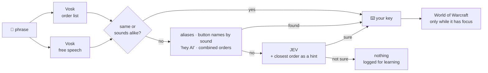

<p align="center">
  
</p>

<p align="center">
  <a href="README.es.md">🇪🇸 Leer en español</a> ·
  <a href="#quick-start">Quick start</a> ·
  <a href="#what-you-can-say">What you can say</a> ·
  <a href="#how-it-works">How it works</a> ·
  <a href="#faq">FAQ</a>
</p>

<p align="center">
  
  
  
  
  
  
</p>

**wow-voz turns your voice into one more input device for World of Warcraft.** Say *"jump"*, *"strafe left"*, *"next target"* or *"cast fireball"*, and it presses the key you would have pressed: the key **you** bound, on **your** action bars. It works in Spanish and English, and the speech recognition runs on your own PC.

It is not a bot. **One spoken order is one key press**, when you say it. Nothing repeats, chains or plays for you. It is built for playing with a controller or one hand on the mouse, for accessibility, or for keeping your hands free while you walk around town.

```text
21:04:24  "focus"                  -> focus                  via vosk      (84 ms)
21:15:07  "se coger todo"          -> interact (loot)        via vosk+jev  (433 ms)
21:17:37  "volpi siniestro"        -> button Golpe siniestro via vosk~     (91 ms)
21:31:38  "gira izquierda"         -> turn_left 90°          via vosk      (64 ms)
```
<sub>From a real session's log (aligned). Misheard words still find the right order: "volpi siniestro" was *Golpe siniestro* (Sinister Strike).</sub>

## Highlights

- 🎯 **Reads your real key bindings.** A tiny read-only addon tells wow-voz which key does what, and which spell, item or macro sits on each button. Say the spell's name and it presses that button's key. You don't map anything by hand.
- ⚡ **Fast and offline.** [Vosk](https://alphacephei.com/vosk/) recognizes speech locally in 50–300 ms, twice at once: against the list of orders, and freely.
- 🧠 **Understands loose phrasing (optional).** When a phrase isn't an exact order, [JEV](#jev-optional) (a small decision model) picks the order you meant, or none. "loot the corpse", "cast sinister strike" and "turn a little bit to the right" all work. Only the text is sent, never audio.
- 📚 **Learns your mishearings (optional).** Missed phrases followed by the order you repeated become aliases, after an hourly review by an AI agent. The code checks the evidence, so one fluke never becomes a rule.
- 🎮 **Made for controller and gamepad UI players.** It runs alongside the gamepad. An in-game **Voice: ON/OFF** button, beeps on the PC speakers, and "focus" and loot feedback in the chat.
- 🌍 **Spanish and English**, picked from your game's language. Adding a language takes one file.
- 🛡️ **Safe by design.** Keys go only to the WoW window, holds are capped, and *"stop"* releases everything at once.

## Quick start

You need a microphone on the PC that runs the game, and Python 3.10+.

<details open>
<summary><b>🐧 Linux</b> (Wine, Lutris, Steam/Proton) — tested</summary>

```bash
git clone https://github.com/alseif0x/wow-voz.git && cd wow-voz
./install.sh                  # venv + Vosk models + addon + systemd user units
systemctl --user start wow-voz
journalctl --user -u wow-voz -f   # see what it hears and does
```
`install.sh` finds WoW under `~/Games`, `~/.wine` or Steam's `compatdata` (or pass `--addons <AddOns folder>`). The virtual keyboard needs `/dev/uinput`, and the installer tells you how to allow it if it isn't allowed yet. Works on X11 and on Wayland desktops, because WoW under Wine is an Xwayland window.
</details>

<details>
<summary><b>🪟 Windows</b> — experimental</summary>

```powershell
git clone https://github.com/alseif0x/wow-voz.git; cd wow-voz
powershell -ExecutionPolicy Bypass -File install.ps1
& "$env:LOCALAPPDATA\wow-voz\wow-voz.cmd"
```
Keys are sent with `SendInput` scan codes, following your keyboard layout. If WoW runs as administrator, run wow-voz as administrator too.
</details>

<details>
<summary><b>🍎 macOS</b> — experimental</summary>

```bash
git clone https://github.com/alseif0x/wow-voz.git && cd wow-voz
./install.sh
"$HOME/Library/Application Support/wow-voz/venv/bin/python" -m wowvoz
```
Allow your terminal in *System Settings › Privacy & Security* under **Accessibility** (to press keys), **Microphone**, and **Screen Recording** (only for the in-game ON/OFF button).
</details>

Then, in the game: restart it once so it finds the new **WoW Voz** addon, `/reload`, and speak. Test a phrase without the microphone:

```bash
python -m wowvoz --say "jump twice" --lang en     # -> jump x2
python -m wowvoz --say "salta dos veces"          # -> jump x2 (Spanish)
python -m wowvoz --calibrate                      # set the microphone threshold for your room
```

## What you can say

A few of each. The full lists are in [`wowvoz/lang/en.py`](wowvoz/lang/en.py) and [`wowvoz/lang/es.py`](wowvoz/lang/es.py). Anything close, or said another way, goes to JEV.

| English | Español | Does |
|---|---|---|
| jump · jump twice · hop | salta · salta dos veces | Jump (up to 5 times) |
| jump left / forward | salta a la izquierda / adelante | Jump while moving that way |
| forward · move back · backpedal (+ "three" = 3 s) | adelante · atrás · retrocede | Walk forward/back a moment |
| left · a little right · turn left · hard left | izquierda · un poco a la derecha · gira a la izquierda · mucho a la izquierda | Turn 45° · 20° · 90° · 135° |
| turn around · turn right thirty degrees | media vuelta · gira a la derecha treinta grados | 180° / the degrees you say |
| strafe left · step right | paso a la izquierda · de lado a la derecha | Strafe |
| walk · run · auto run · slow down · faster | camina · corre · automático · despacio · más rápido | Walk or run ahead, autorun, change speed |
| stop · halt | para · alto | Release everything, end autorun |
| next target · target friend · assist | siguiente objetivo · objetivo amigo · asiste | Targeting |
| focus · target focus · clear focus · focus ally | focus · vuelve al foco · quita el foco · focus aliado | Focus (it tells you in chat what it did) |
| loot · pick up · interact | recoger · despojar · saquea | Loot the corpse in front of you, talk, open |
| cast fireball · hearthstone · button three | lanza bola de fuego · piedra de hogar · botón tres | The key of the button that has it |
| jump and turn right, then forward | salta y gira a la derecha, luego adelante | Up to 3 orders (all, or none if one isn't clear) |
| map · bags · sit · close | mapa · bolsas · siéntate · cierra | Their keys |
| voice off · voice on | voz pausa · voz activa | Stop / start listening |
| hey AI, where do I turn this in? | oye IA, ¿dónde entrego esto? | Ask [WoW AI](https://github.com/chelinho139/wow-ai) (if installed) |

**Beeps:** a rising tone means on, a falling tone off, a tick when an order is pressed, and a buzz when it can't be (no key for it, or WoW isn't the active window).

## How it works



- **The addon** (`addon/WoWVoz`) only reads. It saves your bindings and what's on each action button, and wow-voz reads that file after `/reload`. Actions with no keyboard key (focus macros, "interact", WoW AI's Talk) get a free key such as Ctrl+Shift+F12, only for the session, without touching your settings.
- **The in-game button** paints an 8×8 pixel square in the top-right corner (magenta = on, cyan = off), and wow-voz reads it off the game window. No hooks, no memory reading.
- **Keys** come from a virtual keyboard (`/dev/uinput` on Linux, `SendInput` on Windows, Quartz events on macOS), exactly like a real one.

## Optional extras

### JEV (optional)
JEV (`typesafe/jev-1.13`) is a decision model reached through [OpenRouter](https://openrouter.ai/). wow-voz asks it one multiple-choice question: *which of these orders, or none?* It acts only at ≥ 0.8 confidence, and it takes numbers from your own words, never from the model. Put your key in `~/.config/wow-voz/openrouter.env` (`OPENROUTER_API_KEY=...`) or in the environment. Without it, exact orders, aliases and name-by-sound matching still work.

### Learning from misses (optional)
Every missed phrase goes to `~/.cache/wow-voz/misses.jsonl`, along with the order you said right after it. An hourly timer (`wow-voz-learn`) shows them to an agent (`claude -p` by default; any CLI that reads a prompt and prints JSON works). The agent proposes aliases, and the code keeps only the ones the log backs up (followed by that order twice, or once plus JEV's guess). They land in `~/.config/wow-voz/learned.json`. Your own aliases go in `~/.config/wow-voz/aliases.json`:

```json
{ "evis": "button:Eviscerate", "hop hop": {"order": "jump", "count": 2}, "nudge right": {"order": "turn_right", "degrees": 10} }
```

### WoW AI
With the [WoW AI](https://github.com/chelinho139/wow-ai) addon, *"hey AI, …"* hands the recorded phrase to its chat, so you can ask an AI agent about quests, gear or macros without typing.

## Configuration

`~/.config/wow-voz/config.json` overrides the defaults in [`wowvoz/config.py`](wowvoz/config.py). The ones you might touch:

| Key | Default | |
|---|---|---|
| `language` | `"auto"` | `"es"`, `"en"`, or the game's language |
| `threshold` | `700` | Microphone level that counts as voice (`--calibrate` sets it) |
| `microphone` / `inputDevice` | `"auto"` / `null` | `arecord` or `sounddevice`, and which input |
| `turnDegrees` | `45` | A bare "left"/"right" |
| `holdSeconds` / `maxHoldSeconds` | `1` / `5` | How long "forward" walks |
| `jevMinConfidence` | `0.8` | How sure JEV must be |
| `beeps` / `beepOnOrder` | `true` | Sounds |
| `gameSwitch` | `true` | Follow the in-game ON/OFF button |
| `learnCommand` | `claude -p --model opus --effort low` | The agent that reviews misses |

## FAQ

**Is this allowed?** Blizzard's rules forbid automation: bots, and one key press that does several actions. wow-voz is one spoken order = one key press, like key remapping or accessibility voice tools, but there's no official statement that allows it by name. Use it knowing that.

**"focus" does nothing.** Select a target first: the chat now says *"focus: no target"* if there's none. Forever has no focus frame, so the WoW Voz button shows *Focus: name* below it.

**Nothing is pressed.** WoW must be the active window. The log says *"WoW is not the active window"* and you hear a buzz. On Linux, check that `/dev/uinput` is writable.

**It hears me talking to someone else.** Say *"voice off"*, click the in-game button, or run `wow-voz-toggle` (Linux; bind it to a desktop shortcut). Ordinary speech rarely matches an order: JEV answers *none* for conversation.

**Which WoW versions?** It's developed on WoW Forever (Interface 16001). The addon uses standard APIs, so on other versions enable *Load out of date AddOns*, or change the `## Interface:` line in `WoWVoz.toc`.

**Can I add my language?** Yes: copy `wowvoz/lang/en.py` to `xx.py`, translate the phrases, set the [Vosk model](https://alphacephei.com/vosk/models) name, and add `"xx"` to `LANGUAGES` in `wowvoz/lang/__init__.py`. A pull request is very welcome.

## Status

| | Linux | Windows | macOS |
|---|---|---|---|
| Recognition, orders, JEV, learning | ✅ | ✅ | ✅ |
| Keys | ✅ played daily | 🧪 unit-tested, needs real-world testing | 🧪 unit-tested, needs real-world testing |
| In-game ON/OFF button | ✅ | 🧪 | 🧪 (needs Screen Recording) |

If you try it on Windows or macOS, an issue saying whether it worked helps a lot.

## Development

```bash
python -m unittest discover -s tests -v   # 39 tests, no microphone or game needed
python -m wowvoz --dry-run                # listen, and print what it would press
python -m wowvoz --keys                   # the key map it read from the addon
```

## Credits

[Vosk](https://alphacephei.com/vosk/) (offline speech recognition) · JEV by TypeSafe, via [OpenRouter](https://openrouter.ai/) · the order phrases follow voice-control profiles players already use, like [SpecialEffect's GameAccess pack for WoW](https://gameaccess.info/how-to-play-world-of-warcraft-with-voice-controls-draft/) and VoiceAttack profiles.

Not affiliated with or endorsed by Blizzard Entertainment. World of Warcraft is a trademark of Blizzard Entertainment, Inc.

## License

[MIT](LICENSE)
